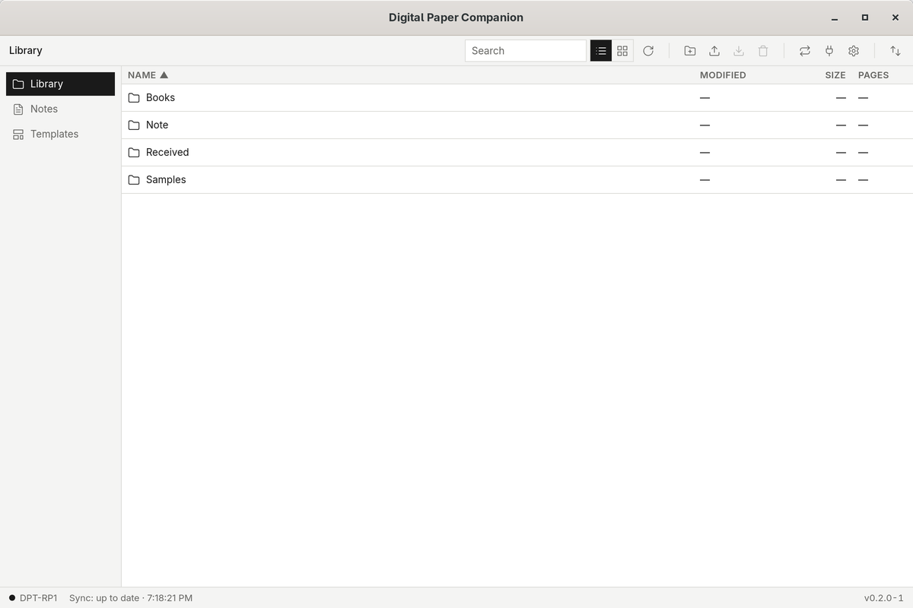
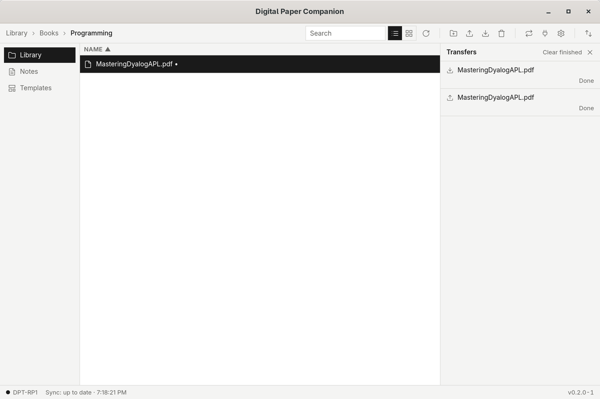
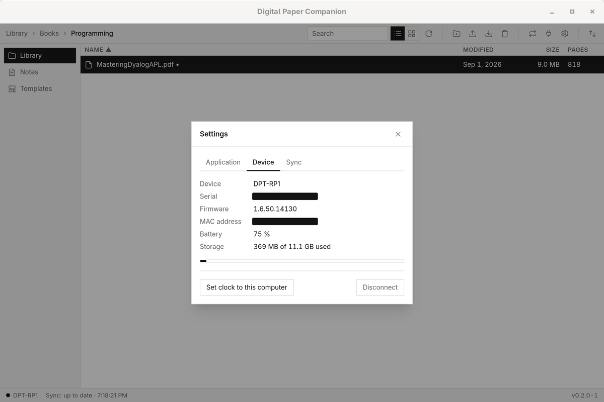

# Digital Paper Companion

A free, cross-platform desktop companion for **Sony Digital Paper**
(DPT-RP1 / DPT-CP1) and compatible devices such as the Fujitsu Quaderno —
a replacement for Sony's discontinued official Digital Paper App.

Built with **Rust** and **Tauri 2**; runs on Windows, macOS and Linux.

> Pre-release (`0.4.x`). Feature status is below; the phase plan is in
> [docs/08-roadmap.md](docs/08-roadmap.md). The full product definition
> lives in [docs/](docs/).

## Screenshots

Library browser:



Transfers:



Device status:



## Features

| Feature                                                      | Status      |
| ------------------------------------------------------------ | ----------- |
| PIN pairing, mDNS / manual connect, auto-reconnect           | Implemented |
| Browse, search, upload, download, organize documents         | Implemented |
| Transfer queue (progress, cancel, retry)                     | Implemented |
| Folder sync: two-way or mirror, preview, schedule, conflicts | Implemented |
| Device status and set clock from this computer               | Implemented |
| Notes view (`Document/Note`, grouped by month)               | Implemented |
| Open a document on the device                                | Implemented |
| Device settings editor (incl. advanced keys), Wi-Fi, screenshots | Implemented |
| Note templates (add, delete)                                 | Implemented |
| USB connection (Ethernet-over-USB mode switch)               | Implemented |
| Bluetooth PAN address preset                                 | Implemented |
| Multiple devices, switch from the sidebar                    | Implemented |
| Credential import from Sony's app / `dptrp1`                 | Implemented |
| UI in 10 languages (EN, DE, ES, FR, IT, JA, ZH-Hans, ZH-Hant, AR, HE) incl. RTL layout | Implemented |
| Automatic Update Check                                       | Implemented |

## Installing unsigned builds

The installers are **not code-signed** (this is a hobby project — see
[docs/08-roadmap.md](docs/08-roadmap.md), Post-1.0). The app is open
source and built by [CI](.github/workflows/release.yml); the OS warning
only means no certificate was purchased. One-time steps on first launch:

- **Windows**: SmartScreen shows *"Windows protected your PC"* — click
  **More info → Run anyway**.
- **macOS**: the app is blocked as unverified. Open **System Settings →
  Privacy & Security**, scroll down and click **Open Anyway** (macOS 15+;
  on older versions right-click the app → **Open**). Alternatively:
  `xattr -d com.apple.quarantine "/Applications/Digital Paper Companion.app"`.
- **Linux**: no signing expected; nothing to do.

## Connecting over USB or Bluetooth

Besides Wi-Fi, the device speaks the same protocol over two other
transports (see [docs/sony-digital-paper-protocol.md](docs/sony-digital-paper-protocol.md) §2):

**USB.** Plug the device in; it first enumerates as a serial port. In
*Connect to device → Connect via USB cable*, switch it to network mode
(RNDIS for Windows, CDC/ECM for macOS/Linux — chosen automatically). The
device then re-appears as a network interface; configure that interface
for link-local addressing (no DHCP) and connect via discovery or
`digitalpaper.local`. On Windows 11 the deprecated RNDIS driver may be
missing; use the CDC/ECM mode instead.

**Bluetooth PAN.** Pair the device in your computer's Bluetooth settings
and enable Bluetooth on the device. It joins as a personal-area network
with the fixed address `172.25.47.1` — *Connect to device → Use Bluetooth
PAN address* pre-fills it.

## Development

Two interchangeable dev environments are provided; pick one.

### Option A: Docker (recommended)

Requires Docker with the Compose plugin. The image contains Rust, Node 22
and all Tauri Linux dependencies on a Debian base — identical for every
contributor and to CI. `target/` and `node_modules/` live in named volumes,
so container builds never collide with host builds.

```bash
docker compose build                       # once (and after Dockerfile changes)
docker compose run --rm dev npm install    # once
docker compose run --rm dev                # interactive shell
docker compose run --rm dev npm run check  # lint + typecheck + tests
docker compose run --rm dev npm run build  # release bundles
```

GitHub access from inside the container — two options:

- **Reuse the host's `gh` login** (recommended if you have one):
  `export DPC_GH_CONFIG=$HOME/.config/gh` (e.g. in a `.env` file next to
  `docker-compose.yml`), then recreate the container. Your host login is
  bind-mounted read-write into the container.
- **Log in inside the container**: run `gh auth login` once (device flow —
  a one-time code you confirm in the browser). The login persists across
  rebuilds in the `gh-config` volume. Note the volume starts empty: this
  login is needed once after the volume is first introduced.

Either way `gh auth setup-git` (run automatically by the dev container)
makes `git push` use it. If you push changes to `.github/workflows/`,
the token needs the `workflow` scope: `gh auth refresh -s workflow`.
Cursor/VS Code's own GitHub session only covers the Source Control panel
and integrated terminals, not other shells.

Running the GUI (`npm run dev`) from inside the container works on X11
and on Wayland (via XWayland). If the window fails with
*“Authorization required …: Failed to initialize GTK”*, allow local X
connections once on the **host**: `xhost +local:` — then rerun. The
compose file also forwards `XAUTHORITY`/`XDG_RUNTIME_DIR`, so with an
exported xauth cookie no `xhost` is needed (recreate the container after
pulling compose changes). Cursor/VS Code users can instead open the repo
as a **Dev Container** (configuration in `.devcontainer/`), which uses
the same compose service.

Note on permissions: the compose service runs as container root by default,
which is correct for **rootless Docker** (container root = your host user).
On classic rootful Docker, run as the unprivileged user instead:
`DPC_CONTAINER_USER=dev docker compose run --rm dev`.

### Option B: Nix shell (NixOS hosts)

```bash
nix-shell              # provides rustc, cargo, node, npm + Tauri libs
npm install            # frontend dependencies
npm run dev            # full app: vite dev server + tauri window
```

### Manual setup

Rust (stable), Node.js ≥ 22, plus the
[Tauri 2 prerequisites](https://tauri.app/start/prerequisites/) for your
platform (on Linux: WebKitGTK 4.1, GTK 3, libsoup 3, OpenSSL, pkg-config).

Useful scripts (see `package.json`):

| Script          | Purpose                                                                 |
| --------------- | ----------------------------------------------------------------------- |
| `npm run dev`   | Run the desktop app in development mode (hot reload)                    |
| `npm run build` | Build release bundles for **this** OS (`.deb`/`.rpm`/AppImage on Linux) |

Installers for Windows (`.msi`/`.exe`) and macOS (`.dmg`) are produced by
[`.github/workflows/release.yml`](.github/workflows/release.yml) — Tauri
cannot be cross-compiled from one OS. After the repo is on GitHub, run
**Actions → Release → Run workflow**, or push a `v*` tag.
| `npm run dev:web` | Frontend only, in a browser (no Tauri APIs) |
| `npm run typecheck` / `lint` / `format` | Frontend checks |
| `npm run check:rust` | `cargo fmt --check`, `clippy`, `cargo test` |
| `npm run check` | Everything above |

### Repository layout

- `crates/dpt-core` — protocol client + sync engine (pure Rust, no Tauri);
  see [docs/04-architecture.md](docs/04-architecture.md)
- `src-tauri` — Tauri application layer (crate `dpt-app`)
- `src` — React/TypeScript frontend
- `docs` — product definition and the
  [device protocol specification](docs/sony-digital-paper-protocol.md)

### Notes

- The app icon is a placeholder. Replace it by running
  `npm run tauri icon <path-to-1024px-png>`.
- Editor: Cursor/VS Code users get extension recommendations from
  `.vscode/extensions.json` (rust-analyzer, Tauri, Tailwind, ESLint, …).

## Contributing

See [CONTRIBUTING.md](CONTRIBUTING.md).

## License

Licensed under either of

- [Apache License, Version 2.0](LICENSE-APACHE)
- [MIT license](LICENSE-MIT)

at your option. This project is not affiliated with or endorsed by Sony.
